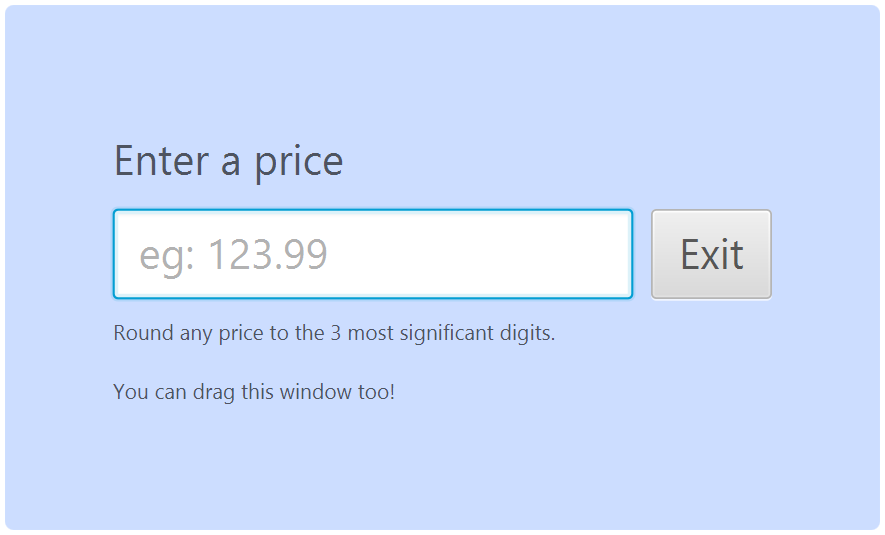

# price-rounder

Small experiment to see how well Kotlin works with JavaFX, which turned out really elegantly. The `apply { }` block function is perfect for building UI controls in code, and Kotlin's lambdas are even more elegant than Java 8's thanks to the implicit `it` parameter for SAM functions.

The app itself just watches a text field (that rejects non-decimal inputs), rounds the input with `BigDecimal#round()`, and displays the result. The window is draggable by its background due to its hidden OS frame.

